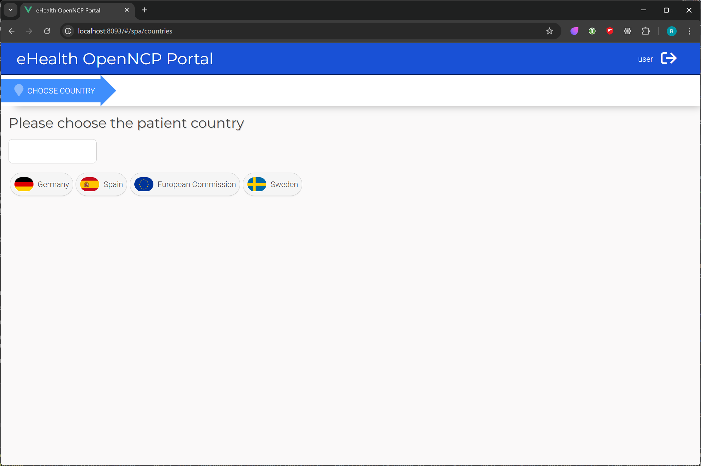

# eHealth + openEHR 🚀

This repository contains instructions and materials for testing the additional benefits of supporting openEHR within the
MyHealth@EU project.

* [Prerequisites](#prerequisites)
* [Getting Started](#getting-started)
    * [OpenNCP](#openncp)
    * [eHealth Portal & Wiremock](#ehealth-portal--wiremock)
* [Testing](#testing)

## Prerequisites

* Java 11
* Docker Dekstop

## Getting Started

### OpenNCP

Start by cloning the forked [repository](https://github.com/konateq/ehealth) of OpenNCP project with the
`openehr-support` branch:

```shell
git clone -b openehr-support https://github.com/konateq/ehealth.git
```

Next, go to the `ehealth` directory and run the following command to build the project:

```shell
./mvnw clean install -P national-connector-mock
```

While the build is running, open the `docker-compose.yml` located in the `openncp-docker` directory and update the
`FHIRSERVER_URL` and `OPENEHR_ENDPOINTS_QUERY_URL` environment variables for the `tomcat_node_a` service with
appropriate values.
The following example uses [WireMock](https://wiremock.org/) to simulate the FHIR server
and [EHRbase](https://www.ehrbase.org/) as openEHR server.

```yaml
services:
  tomcat_node_a:
    environment:
      FHIRSERVER_URL: http://host.docker.internal:9080/fhir/
      OPENEHR_ENDPOINTS_QUERY_URL: https://sandbox.ehrbase.org/ehrbase/rest/openehr/v1/query
```

> [!WARNING]
> * `FHIRSERVER_URL` requires a trailing slash.
> * `OPENEHR_ENDPOINTS_QUERY_URL` must omit the `/aql` path segment (automatically added by the application).

Once the build is complete, run the following command to start all services:

```shell
 docker compose -f openncp-docker/compose-local.yml up
```

When the `openncp_db` service is up and running, run the following command to connect to the database and prompt for the
password
(`Password1` by default):

```shell
docker exec -it openncp_db mysql -u root -p
```

Then, execute the following SQL commands to set up the database:

```sql
UPDATE ehealth_properties.EHNCP_PROPERTY
SET VALUE = 'de,es,eu,se'
WHERE NAME = 'ncp.countries';

INSERT INTO ehealth_properties.EHNCP_PROPERTY (NAME, VALUE, IS_SMP)
VALUES ('DE.openEHRQueryService.WSE', 'https://openncp-server:8443/openncp-ws-server/openehr/v1/query/aql', false),
       ('DE.FhirService.WSE', 'https://openncp-server:8443/fhir', false),
       ('ES.openEHRQueryService.WSE', 'https://openncp-server:8443/openncp-ws-server/openehr/v1/query/aql', false),
       ('ES.FhirService.WSE', 'https://openncp-server:8443/fhir', false),
       ('EU.openEHRQueryService.WSE', 'https://openncp-server:8443/openncp-ws-server/openehr/v1/query/aql', false),
       ('EU.FhirService.WSE', 'https://openncp-server:8443/fhir', false),
       ('SE.openEHRQueryService.WSE', 'https://openncp-server:8443/openncp-ws-server/openehr/v1/query/aql', false),
       ('SE.FhirService.WSE', 'https://openncp-server:8443/fhir', false);
```

Lastly, check the logs of all services to ensure that the components have started successfully. Alternatively, check
that you receive the Whitelabel Error Page from Spring Boot while
accessing http://localhost:8090/openncp-ws-server and http://localhost:8091/openncp-client-connector.

### eHealth Portal & Wiremock

Start by cloning this repository if you haven't already:

```shell
git clone https://github.com/konateq/ehealth-openehr.git
```

Next, go to the `ehealth-openehr` directory and run the following command to start eHealth Portal and WireMock:

```shell
docker compose up
```

Once the services are up and running, you can access the eHealth Portal at http://localhost:8093/ and sign in with
`user` and `password` credentials.



## Testing

You can use the following FHIR patients from WireMock to test the openEHR functionality:

| Identifier  | Name               | Country |
|-------------|--------------------|---------|
| `111111111` | Zlatan Ibrahimović | SE      |
| `123456789` | Fabián Ruiz        | ES      |
| `987654321` | Thomas Müller      | DE      |
| `999999999` | Robert Schuman     | BE      |
